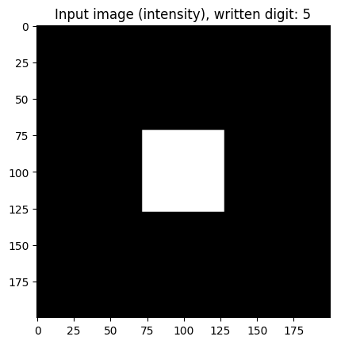
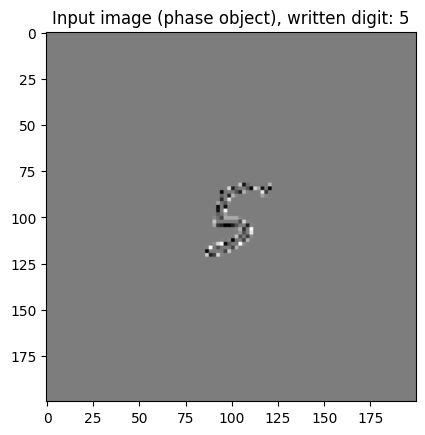
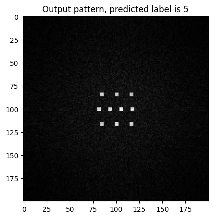

# Thesis_ONN
This code is still under development, the model now is trained on the full train set of [MNIST written digits](https://keras.io/api/datasets/mnist/)  
it converged at (data) loss=0.8756, accuracy=84.4533%.\
\
This model can be further improved by 1) introducing complex modulation (amplitude and phase modulation) and 2) add more optical layers.
The script used for training is [train.py](https://github.com/KMarshallX/Thesis_ONN/blob/master/train.py). 
```
The optical parameters used for the model are:

units = 200 (pixels) # input dimension
planeSpacing = 5e-2 (metres) # plane spacing
wavelength = 1565e-9 (metres)
pixelSize = 8e-6 (metres)
numLayers = 5   # number of optical layers
learningRate = 1e-2 # learning rate
epochs = 5  # training epochs

```
# Layer and Model
Please see [this code](https://github.com/KMarshallX/Thesis_ONN/blob/master/model/ONN.py) for the code of the optical layer and the model. 
# Conducted experiments
## 1. Experiment 1
In this experiment, the dimensions of the input images and layers within the model have been set to (200 * 200). The input image is an intensity pattern, the size of the intensity pattern is (56 * 56) and been padded to (200 * 200):
<p align="center">

</p>

**Results:**
1. The accuracy reached **84.4533%** after 5 epochs
2. Output intensity patterns:
<p align="center">

</p>

3. For detailed information and phase masks patterns, please refer to [this notebook](https://github.com/KMarshallX/Thesis_ONN/blob/master/validate_200.ipynb) 

## 2. Experiment 2
In this experiment, the dimensions of the input images and layers within the model have been set to (56 * 56). The input image is an intensity pattern, the size of the intensity pattern is (56 * 56) without padding:
<p align="center">

</p>

**Results:**
1. The accuracy reached **85.7817%** after 5 epochs
<p align="center">

</p>

2. Output intensity patterns:
<p align="center">

</p>

3. For detailed information and phase masks patterns, please refer to [this notebook](https://github.com/KMarshallX/Thesis_ONN/blob/master/validate_56.ipynb) 

## 3. Experiment 3
In this experiment, the input images have been converted to phase images. The dimension was (200 * 200), the size of image pattern was (56 * 56) and padded to (200 * 200):
<p align="center">


</p>

**Results:**
1. The accuracy reached **80.7633%** after 2 epochs
<p align="center">

</p>

2. Output intensity patterns:
<p align="center">

</p>

3. For detailed information and phase masks patterns, please refer to [this notebook](https://github.com/KMarshallX/Thesis_ONN/blob/master/validate_200_phase.ipynb) 

## 4. Experiment 4 (updated in 04/20/2023)
Changed the initialization of the optical layers: changed from random distribution to full zeros. Below shows the input and output intensity pattern, and the first phase mask.\
Other changed parameters: number of layers = 7, plane spacing = 0.005 (metres)\
Input image:
<p align="center">

</p>

**Results:**
1. The accuracy reached **87.5967%** after 5 epochs
<p align="center">

</p>

2. Output intensity patterns:
<p align="center">

</p>

3. The first and the last phase masks:
<p align="center">


</p>

4. For detailed information and phase masks patterns, please refer to [this notebook](https://github.com/KMarshallX/Thesis_ONN/blob/master/validate_200_planeSpacing5cm.ipynb) 

## 5. Experiment 5 (updated in 04/24/2023)
Changed the dimension from 200 to 256, \
the size of the digit pattern changed from 56 to 38, \
the detector area size changed from 4 to 3. \
Below shows the input and output intensity pattern, and the first phase mask.\
Input image:
<p align="center">

</p>

**Results:**
1. The accuracy reached **85.9317%** after 5 epochs
<p align="center">

</p>

2. Output intensity patterns:
<p align="center">

</p>

3. The first and the last phase masks:
<p align="center">


</p>

4. For detailed information and phase masks patterns, please refer to [this notebook](https://github.com/KMarshallX/Thesis_ONN/blob/master/validate_256_MPLCsetup.ipynb) 

# First MPLC setup
1. The generated phase masks of each layer:
<p align="center">

</p>

2. Intensity patterns of each layer:
<p align="center">

</p>

