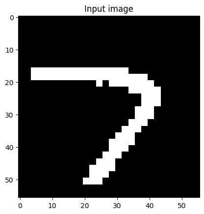
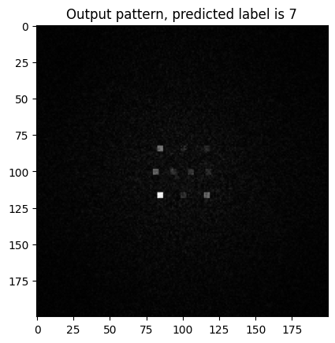

# Thesis_ONN
This code is still under development, for faster training purposes, I tried to overfit the model to a small dataset (20 iteration through 5000 samples from MNIST written digits dataset), 
it converged at (data)loss=1.4598, accuracy=45% (±10%).\
\
This model can be further improved by using larger size of dataset, and a low learning rate, however, this could cost 1 day to run through all of the 60,000 samples in the original MNIST data.
Tune the neccessary parameters in [train.py](https://github.com/KMarshallX/Thesis_ONN/blob/master/train.py), and run it. For the training detail and more explicit training process, please refer to this [jupyter notebook](https://github.com/KMarshallX/Thesis_ONN/blob/master/train.ipynb) instead.
# Layer and Model
Please see [this code](https://github.com/KMarshallX/Thesis_ONN/blob/master/model/ONN.py) for the code of the optical layer and the model. Line **53~82**, describes the mechanism of each optical layer (phase modualtion & free space propagation).
# Output of the Model
The whole model is trained using the first 5000 samples of MNIST written digit dataset, with a learning rate of 5e-3, the accuracy converges to around 45%.\
When an digit image is fed into the trained model (as below),\
\
there will be an area with a the highest light intensity on the output image:\
\
Other classification area can roughly be seen on the output image, from top to bottom, left to right, each squre represents **(0,1,2,3,4,5,6,7,8,9)** respectively.\
Below attached some predictions made by the trained model:\

\

\

\

\
For a clear and distinguishable digit outside the range of the training dataset, the model also has a good performance:\
(This chose image is the 5999th sample in the MNIST written digit dataset)\

